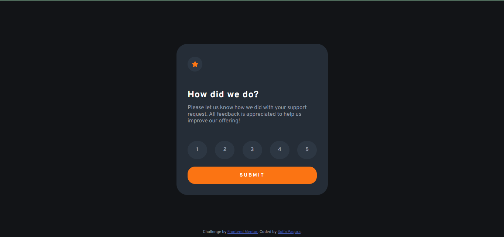
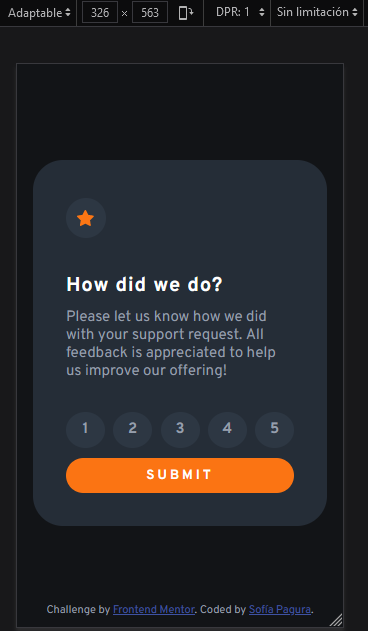

# Frontend Mentor - Interactive rating component solution

This is a solution to the [Interactive rating component challenge on Frontend Mentor](https://www.frontendmentor.io/challenges/interactive-rating-component-koxpeBUmI). Frontend Mentor challenges help you improve your coding skills by building realistic projects.

## Table of contents

- [Overview](#overview)
  - [The challenge](#the-challenge)
  - [Screenshot](#screenshot)
  - [Links](#links)
- [My process](#my-process)
  - [Built with](#built-with)
  - [What I learned](#what-i-learned)
  - [Useful resources](#useful-resources)
- [Author](#author)
- [Acknowledgments](#acknowledgments)

**Note: Delete this note and update the table of contents based on what sections you keep.**

## Overview

### The challenge

Users should be able to:

- View the optimal layout for the app depending on their device's screen size
- See hover states for all interactive elements on the page
- Select and submit a number rating
- See the "Thank you" card state after submitting a rating

### Screenshot




### Links

- Solution URL: [vercel](https://vercel.com/sofpag/interactive-rating-component)

## My process

- html
- css
- js: need to see a lot from W3S and other developers

### Built with

- Semantic HTML5 markup
- CSS custom properties
- Flexbox

**Note: These are just examples. Delete this note and replace the list above with your own choices**

### What I learned

Use of "var" in CSS

```css
:root {
  --color-orange: hsl(25, 97%, 53%);
  --color-grey: hsl(217, 12%, 63%);
  --color-medium-grey: hsl(216, 12%, 54%);
  --color-dark-blue: hsl(213, 19%, 18%);
  --color-very-dark: hsl(216, 12%, 8%);
}
```

Use of foreach and eventListener in JS

```js
let rating;

scoresAll.forEach((score) => {
  score.addEventListener("click", (e) => {
    scoresAll.forEach((score) => {
      score.classList.remove("highlight");
    });
    e.target.classList.add("highlight");
    rating = e.target.innerText;
  });
});
```

```js
submit.addEventListener("click", (e) => {
  e.preventDefault();
  if (!rating) {
    alert("chose one number");
  } else {
    scoreBox.classList.add("hidden");
    thankYouBox.classList.remove("hidden");
    scoreChosen.textContent = rating;
  }
});
```

## Author

- Frontend Mentor - [@Sofía ](https://www.frontendmentor.io/profile/sofpag)
